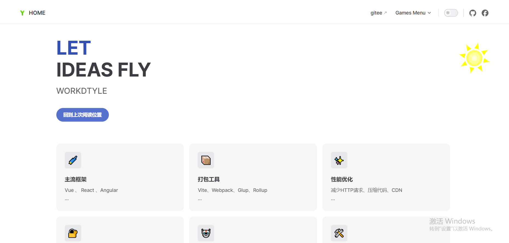

# 开始

## 介绍

一个文档项目，可以用来编写组件库文档

## 项目架构

vitePress + Vue3 + Markdown

## 安装教程

1.  依赖：npm install

2.  运行：npm run dev

3.  构建：npm run build

（默认输出 ESM 格式的包，如需输出 CommonJS 或 UMD 格式的包，需要在 package.json 中把“type”: “module”去掉，或把.vitepress 目录下的 config.mts 后缀改成 config.ts）

4.  github pages 部署构建： npm run add-build || 把 dist 的内容拷贝到根目录中

## 使用说明

1.  快捷部署：

    deploy.config.ts 填写服务器配置

    npm run deploy:upload 部署前端代码

    npm run deploy:revert 回滚前端代码

## 样例

