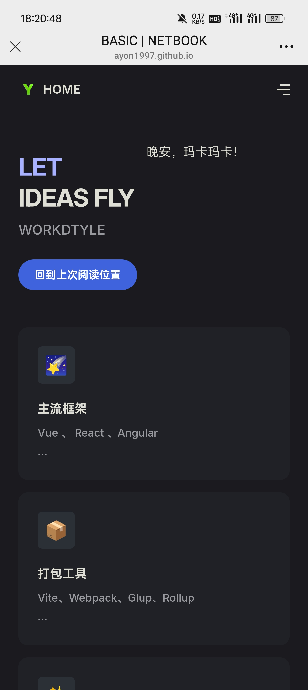
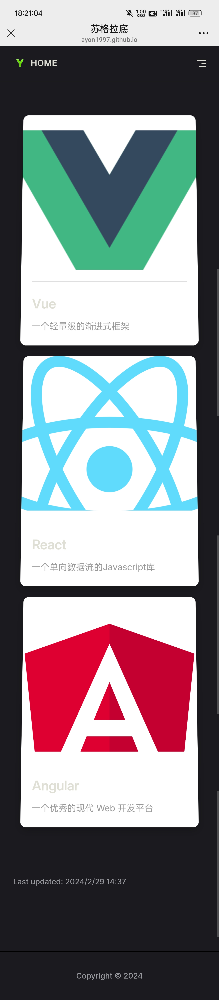

# 开始

## 介绍

这是一个学习导航网站项目，旨在为学习者提供一个聚合各类优质学习资源的平台。它能帮助学习者快速梳理和定位不同领域的学习内容，高效规划学习路径，促进知识的获取与积累，方便学习者之间交流和协作，共同进步 。

## 项目架构

采用 `vitePress + Vue3 + Markdown` 的组合。`vitePress` 基于 `Vite` 构建，提供了简洁且强大的文档生成能力；`Vue3` 作为流行的前端框架，为项目赋予了灵活的交互性；`Markdown` 则用于内容编写，方便简洁，易于上手。

## 安装教程

1. **依赖安装**：运行 `npm install` 命令，安装项目所需的各种依赖包，确保项目运行环境搭建完成。
2. **本地运行**：执行 `npm run dev` ，启动本地开发服务器，你可以在浏览器中实时预览文档效果，便于开发与调试。
3. **项目构建**：使用 `npm run build` 进行项目构建，将项目代码打包成可部署的静态文件。（默认输出 ESM 格式的包，如需输出 CommonJS 或 UMD 格式的包，需要在 `package.json` 中把 `"type": "module"` 去掉，或把 `.vitepress` 目录下的 `config.mts` 后缀改成 `config.ts`）
4. **github pages 部署构建**：执行 `npm run add-build` ，或者手动把 `dist` 的内容拷贝到根目录中，完成在 github pages 上的部署构建。

## 使用说明

1. **快捷部署**：
   - 在 `deploy.config.ts` 中填写服务器配置，确保部署目标明确。
   - 运行 `npm run deploy:upload` 部署前端代码，将最新代码上传至服务器。
   - 若需要回滚前端代码，执行 `npm run deploy:revert` 即可。

## 样例

